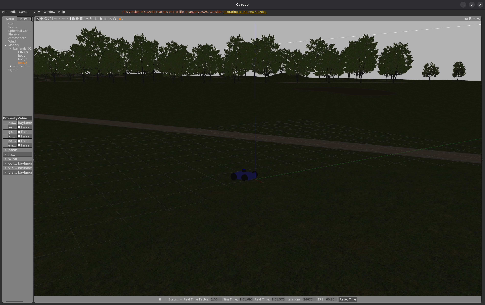
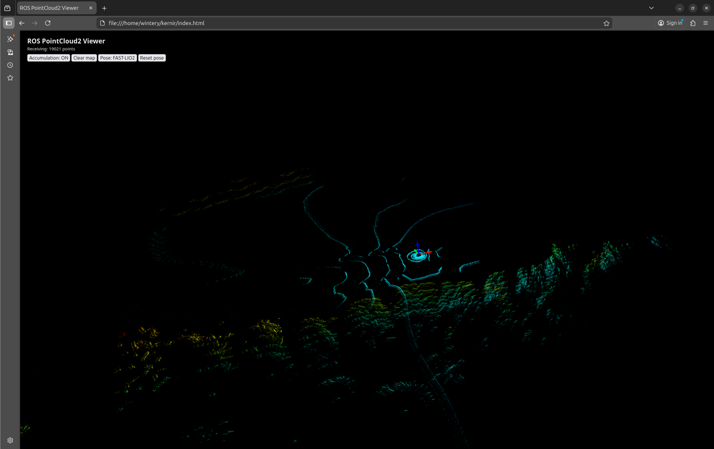

# Kernir

Robotics simulation platform for autonomous rover development with LiDAR-Inertial-Visual odometry. Combines ArduPilot SITL, Gazebo simulation, and FAST-LIVO2 perception in a fully containerized environment.





## Features

- **ArduPilot SITL** - Full rover autopilot with MAVProxy console
- **Gazebo 11** - Physics simulation with VLP-16 LiDAR, IMU, and camera sensors
- **FAST-LIVO2** - Real-time LiDAR-Inertial-Visual odometry and mapping
- **Web Viewer** - Browser-based visualization via rosbridge WebSocket
- **QGroundControl** - Optional ground control station
- **Fully Dockerized** - No manual ROS/Gazebo installation required

## Prerequisites

- **Docker** with Compose V2
- **NVIDIA GPU** with drivers installed
- **NVIDIA Container Toolkit** ([installation guide](https://docs.nvidia.com/datacenter/cloud-native/container-toolkit/install-guide.html))
- **X11** for GUI (Gazebo, RViz, MAVProxy)

```bash
# Allow X11 forwarding (run once per session)
xhost +local:docker
```

## Quick Start

```bash
# Clone the repository
git clone https://github.com/yourusername/kernir.git
cd kernir

# Build containers (first run takes ~10-15 minutes)
./docker.sh up
```

Once running:
1. **Gazebo** window opens with rover in environment
2. **MAVProxy** console shows ArduPilot status
3. **FAST-LIVO2** begins mapping (view in RViz or web viewer)
4. Open `index.html` in browser for web visualization

### Basic Commands

```bash
./docker.sh start              # Start Gazebo + FAST-LIVO2
./docker.sh stop               # Stop all containers
./docker.sh ardupilot          # Run ArduPilot with console
./docker.sh shell              # Shell into Gazebo container
./docker.sh shell-ardupilot    # Shell into ArduPilot container
./docker.sh logs               # Follow container logs
./docker.sh status             # Show container status
```

### Controlling the Rover

In MAVProxy console:
```
arm throttle      # Arm the rover
mode guided       # Switch to guided mode
mode manual       # Switch to manual mode
rc 3 1600         # Throttle forward (channel 3, PWM 1600)
rc 3 1500         # Stop (neutral)
rc 1 1600         # Turn right (channel 1)
disarm            # Disarm
```

## Architecture

```
┌──────────────────────────────────────────────────────────────────┐
│                    Docker Compose (host network)                  │
├────────────────────┬────────────────────┬────────────────────────┤
│  ros-gazebo        │  ardupilot-sitl    │  fast-livo             │
│  ├─ Gazebo 11      │  ├─ Rover SITL     │  ├─ FAST-LIVO2         │
│  ├─ ROS Noetic     │  └─ MAVProxy       │  └─ Odometry output    │
│  ├─ Velodyne VLP16 │                    │                        │
│  └─ rosbridge:9090 │  UDP 9002/9003     │  Publishes:            │
│                    │  MAVLink:14550     │  ├─ /Odometry          │
│  GPU: NVIDIA       │                    │  ├─ /path              │
│                    │                    │  └─ /Laser_map         │
└────────────────────┴────────────────────┴────────────────────────┘
                              ▲
                              │ WebSocket :9090
                    ┌─────────┴─────────┐
                    │  Web Viewer       │
                    │  (index.html)     │
                    └───────────────────┘
```

**Data Flow:**
1. Gazebo simulates rover with sensors (LiDAR, IMU, camera)
2. ArduPilot SITL receives sensor data, controls motors
3. FAST-LIVO2 processes sensor streams for real-time SLAM
4. Web viewer displays point cloud and odometry via rosbridge

## ROS Topics

### Sensor Topics (from Gazebo)

| Topic | Type | Rate | Description |
|-------|------|------|-------------|
| `/velodyne_points` | `PointCloud2` | 10Hz | VLP-16 LiDAR |
| `/imu/data` | `Imu` | 200Hz | IMU data |
| `/camera/image_raw` | `Image` | 30Hz | Camera (640x480) |

### FAST-LIVO2 Output

| Topic | Type | Rate | Description |
|-------|------|------|-------------|
| `/Odometry` | `Odometry` | 10Hz | Robot odometry |
| `/path` | `Path` | 10Hz | Trajectory |
| `/Laser_map` | `PointCloud2` | 1Hz | Accumulated map |

## Configuration

### Steering Mode

Edit `docker-compose.yml`:
```yaml
# Skid steering (default)
ARDUPILOT_PARAMS: /params/arcade_4wd.parm

# Ackermann steering
ARDUPILOT_PARAMS: /params/ackermann.parm
```

### Change World

Edit `docker_data/ros_gazebo/entrypoint-gazebo.sh`:
```bash
WORLD=/root/gazebo_worlds/your_world.world
```

Add world files to `docker_data/ros_gazebo/worlds/`.

### FAST-LIVO2 Parameters

Edit `docker_data/fast-livo/config/gazebo_vlp16.yaml`:
- Topic remapping
- Sensor extrinsics
- Algorithm tuning

## Network Ports

| Port | Protocol | Service |
|------|----------|---------|
| 9002/9003 | UDP | ArduPilot FDM (Gazebo ↔ SITL) |
| 9090 | WebSocket | rosbridge (web clients) |
| 11311 | TCP | ROS Master |
| 14550 | UDP | MAVLink (QGroundControl) |

## Project Structure

```
kernir/
├── Dockerfiles/               # Container definitions
├── docker_data/
│   ├── fast-livo/config/      # FAST-LIVO2 configuration
│   ├── ros_gazebo/
│   │   ├── models/            # Gazebo robot models
│   │   └── worlds/            # Simulation environments
│   └── ardupilot_sitl/
│       └── params/            # ArduPilot parameters
├── docker-compose.yml
├── docker.sh                  # Helper script
└── index.html                 # Web viewer
```

## Troubleshooting

### No GUI / Display errors

```bash
# Allow Docker X11 access
xhost +local:docker

# Verify DISPLAY is set
echo $DISPLAY  # Should show :0 or :1
```

### GPU not detected

```bash
# Check NVIDIA runtime
docker run --rm --gpus all nvidia/cuda:11.0-base nvidia-smi

# Install NVIDIA Container Toolkit if missing
# https://docs.nvidia.com/datacenter/cloud-native/container-toolkit/install-guide.html
```

### No data on ROS topics

```bash
# Check if Gazebo is publishing
docker exec ros_gazebo rostopic list
docker exec ros_gazebo rostopic hz /velodyne_points

# Check FAST-LIVO2 logs
docker logs fast_livo
```

### ArduPilot not connecting to Gazebo

```bash
# Ensure Gazebo started first
./docker.sh status

# Check FDM communication (should show data)
docker exec ardupilot_sitl netstat -anu | grep 900
```

### Clean rebuild

```bash
docker compose down
docker rmi ros-gazebo ardupilot-sitl fast-livo2 qgroundcontrol
docker compose build --no-cache
./docker.sh up
```

## Optional: QGroundControl

```bash
# Start QGC container
docker compose up -d qgroundcontrol

# Or run QGC natively - connects via MAVLink on UDP 14550
```

## Related Projects

- [ArduPilot](https://ardupilot.org/) - Autopilot software
- [FAST-LIVO2](https://github.com/hku-mars/FAST-LIVO2) - LiDAR-Inertial-Visual odometry
- [Gazebo](https://gazebosim.org/) - Robot simulation
- [ROS Noetic](https://wiki.ros.org/noetic) - Robot Operating System

## License

MIT
